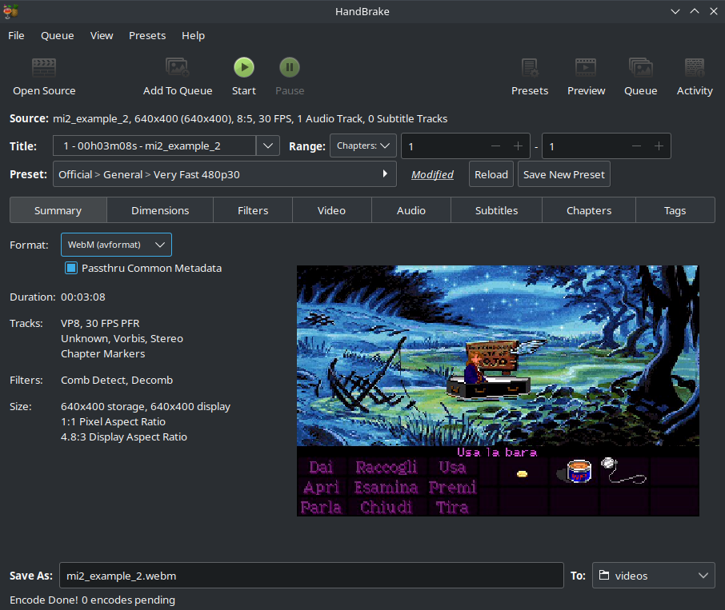
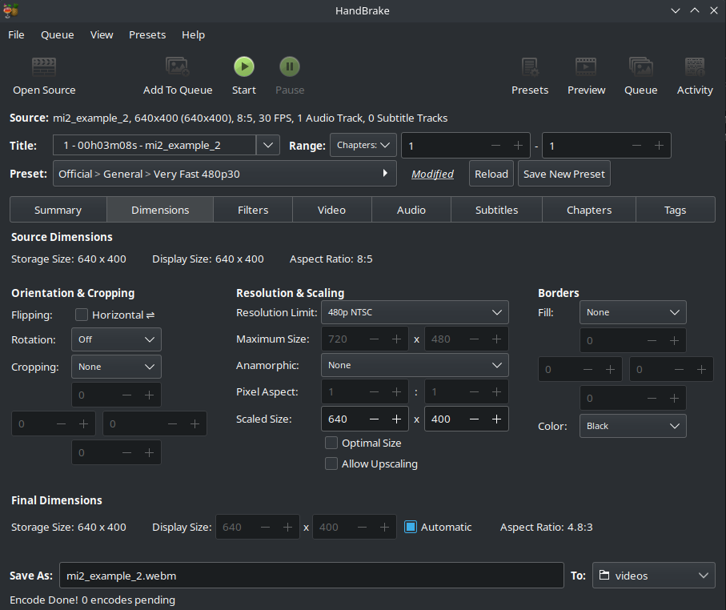

# Encode video with handbrake

1. load mp4 file in handbrake
2. select "Official > General > Very Fast 480p30" as preset
3. select "webM (avformat)" as format

4. in "Dimension" tab, select "None" as cropping, in order for the video not to be automatically cropped by handbrake

5. run the job
